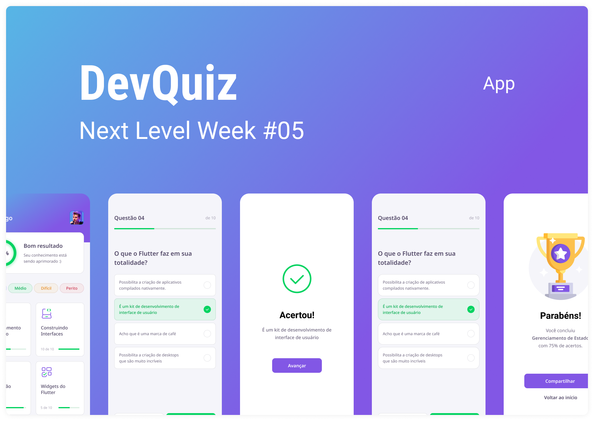

<h1 align="center">
  
</h1>

  

 

 

  

## ✨ Tecnologias

Esse projeto foi desenvolvido com as seguintes tecnologias:

- [Flutter](https://flutter.dev/)
- [Dart](https://dart.dev/)

## 💻 Projeto

O devquiz é um jogo de perguntas para avaliar os seus conhecimentos sobre o mundo de desenvolvimento.

## 🔖 Layout

Você pode visualizar o layout do projeto através [desse link](https://www.figma.com/file/fMqKhwT9L5D3MVe4btRtG5/DevQuiz/duplicate). É necessário ter conta no [Figma](http://figma.com/) para acessá-lo.

## 🚀 Como executar

- Clone o repositório
- Inicie seu app com `flutter run`

## 📄 Licença

Esse projeto está sob a licença MIT. Veja o arquivo [LICENSE](LICENSE.md) para mais detalhes.

---

Feito com ♥ by Rocketseat 👋🏻 [Participe da nossa comunidade!](https://discordapp.com/invite/gCRAFhc)
